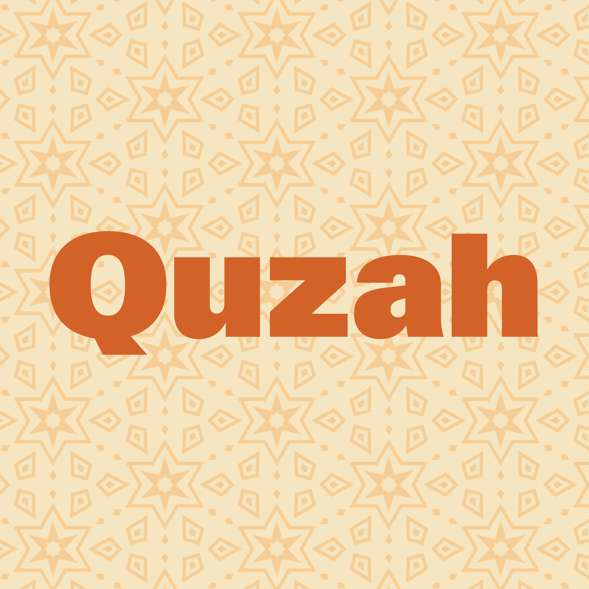

# 🌈 Quzah

Un service d'OAuth2, qui vient se placer en tant qu'intermédiaire entre un service tier et l'ENT, afin de récupéré des informations de l'élève, tels que la classe, le numéro de téléphone etc

# ⚙ Fonctionnement
**Quzah** possède deux protocoles d'authentification qui peuvent être utiliser selon les différents besoins de votre service tier 
- **Authentification basique**
 Permet d'attester que l'utilisateur·rice est bien enregistré sur le Azur de la région Île-de-France et peut se connecter à l'ENT. 
 Ce mode permet d'extraire les données suivantes :
   - 🔓 UUID Azure AD de l'établissement
   - 🎓 Académie / Zone de travail
- **🛠️ Authentification via Proxy d'Identité**
 Se connecte directement sur l'ENT via Puppeteer pour outre-passer la fermeture des données et leur inaccessibilité via un tier non enregistrer sur leur CAS. 
 Ce mode permet d'extraire les données suivantes :
   - **🏫 Scolarité** : Classe, UAI, Nom de l'établissement, Groupes, Académie, Niveau.
   - **👤 Identité** : Nom(s) Prénom(s), Date de naissance, Avatar.
   - **📞 Contact** : Email (ENT & Public), Téléphone, Adresse postale.
   - **👥 Tier(s)** : Nom(s) & Prénom(s)
   
# ⚠️ NOTA-BENE
> Il est cruciale d'utiliser du HTTPS en cas d'utilisation de l'**Authentification via Proxy d'Identité**, celle-ci faisant **transité directement les identifiants de connexion sur le serveur, c'est-à-dire le nom d'utilisateur·rice AINSI que le mot de passe.**   **AUCUN IDENTIFIANT N'EST STOCKER**
